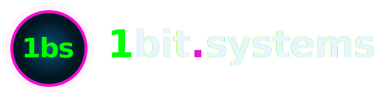

<div align="center">

# 1bit.systems

### ternary inference for the rest of us

[](https://github.com/bong-water-water-bong/1bit-systems/releases/latest)
[](https://github.com/bong-water-water-bong/1bit-systems/actions/workflows/ci.yml)
[](https://github.com/bong-water-water-bong/1bit-systems/releases)
[](https://github.com/bong-water-water-bong/1bit-systems/issues)
[](./CONTRIBUTING.md)
[](./LICENSE)
[](https://star-history.com/#bong-water-water-bong/1bit-systems)
[](https://aur.archlinux.org/packages/1bit-systems-bin)

<br>



<br>

### [Install](https://1bit.systems/install) · [Docs](https://1bit.systems/docs) · [Site](https://1bit.systems) · [Discord](https://discord.gg/dSyV646eBs)

</div>

---

<sub><em>"Whoa."</em></sub>

You bought a Strix Halo because the spec sheet read like science fiction — 128 GB of unified LPDDR5x, Radeon 8060S, an XDNA2 NPU welded onto the die. Then you booted Linux and discovered that the cloud-AI ecosystem still thinks "local" means a 4090 and a 1500W PSU. We built this for the other crowd. The mini-PC-on-the-desk crowd. The closet-server crowd. The "I want a chat endpoint that doesn't phone home" crowd. 1bit.systems is a full ternary inference stack tuned for one machine — `gfx1151` plus its NPU — written in C++ where it has to be fast and Rust where it has to be careful. No Python at runtime. No Docker on the serving path. No telemetry, ever.

<sub><em>"There is no spoon."</em></sub>

## comes in three flavors

* **`lemond`** — the canonical local AI server. C++ HTTP front door. OpenAI / Ollama / Anthropic API surfaces on port `:8180`. Dispatches per-recipe to wrapped backends including the in-process `rocm-cpp` Engine. Forked from `lemonade-sdk/lemonade` and patched in-house — every wedge stays here.
* **`1bit-services`** — the apps tower above lemond. Operator CLI, desktop helm, landing page, voice loop, MCP bridge, power profile control, retrieval pipeline, watchdog. All Rust. All bare metal.
* **`halo-arcade`** — a vanilla-JS canvas-game cabinet that ships in the same release. Because every good rig deserves a coin slot.

## out of the box

Three models auto-load on boot via `lemond-bootstrap.service`. Reachable on `:8180/api/v1/*` the moment the unit is green.

| auto-loaded | role | backend |
|---|---|---|
| `Bonsai-1.7B-gguf:Q1_0` | chat | llama.cpp Vulkan |
| `nomic-embed-text-v1.5` | embeddings | llama.cpp Vulkan |
| `halo-1bit-2b` | chat (ternary) | rocm-cpp ternary |

Eight `.h1b` ternary models ship with the release. All of them are reachable via the unified `/api/v1/*` surface — pull the rest with `1bit pull <name>` when you want them resident. `max_loaded_models=12` so you can mix.

The companion UIs come up alongside lemond:

- **GAIA UI** — `http://localhost:8000/gaia/`. Full FastAPI shim rewritten in C++. 11/11 ctest, 36+ endpoints. Chat, file picker, agent panel.
- **Lemonade UI** — `http://localhost:8000/app/`. The classic lemonade console — model list, recipe inspector, live `/metrics`.

## built by

A two-person crew on a Strix Halo box, plus the kindness of strangers who write good open-source kernels. We use AMD hardware. We are not affiliated with AMD. Anything that looks like a partnership is just us reading their docs at 2am.

## getting started

1. **Install** — pick your medicine on [1bit.systems/install](https://1bit.systems/install). CachyOS and Arch are first-class. The AppImage works on any glibc ≥ 2.35 + ROCm 7.x host.
2. **Get models** — `1bit pull bonsai-1.7b` grabs the ternary weights. We bundle eight `.h1b` ternary models on day one. Bring your own GGUF if you swing that way.
3. **Run** — `1bit run bonsai-1.7b` opens a chat. `lemond` is already serving OpenAI-compat on `:8180`.
4. **Mobile** — `1bit tunnel start` mints a Headscale preauthkey and prints a QR. Scan from the official Tailscale app, point its login URL at `https://headscale.strixhalo.local`, and your phone is on the closet box's mesh. No app store, no middleman. The hosted iOS / Android client is on the roadmap; the Rust core wrapped in uniffi-rs is what makes that boring.
5. **Connect** — point any OpenAI-compatible client at `http://localhost:8180/v1`. Open WebUI, Claude Code, Continue, your weekend Bun script. They all just work.

```sh
curl -fsSL https://1bit.systems/install.sh | sh
1bit install core
1bit run bonsai-1.7b
```

<sub><em>"I know kung fu."</em></sub>

## apps + integrations

Native first, then everything else.

| native (we ship it) | description |
|---|---|
| [`lemond`](https://github.com/bong-water-water-bong/lemonade) | C++ HTTP server. Forked from lemonade-sdk. OpenAI / Ollama / Anthropic surfaces. |
| [`1bit-helm`](./crates/1bit-helm) | egui desktop client. Plasma SNI tray icon. Start / stop / status. |
| [`1bit-landing`](./crates/1bit-landing) | live `/metrics` probe + landing page on `:8190`. |
| [`1bit-voice`](./crates/1bit-voice) | sentence-boundary streaming voice loop (LLM SSE → TTS chunks). |
| [`1bit-echo`](./crates/1bit-echo) | browser WebSocket gateway over `1bit-voice`. |
| [`1bit-mcp`](./crates/1bit-mcp) | stdio JSON-RPC MCP bridge for Claude Code and friends. |
| [`1bit-power`](./crates/1bit-power) | `1bit power` — RyzenAdj wrapper, profile control. |
| [`halo-arcade`](./browser) | vanilla JS canvas games. The good kind. |

| third-party (it just works) | how |
|---|---|
| [Open WebUI](https://docs.openwebui.com/) | point at `http://localhost:8180/v1`. |
| [Claude Code](https://claude.com/claude-code) | Anthropic-compat surface. |
| [Continue](https://continue.dev/) | OpenAI-compat. |
| [stable-diffusion.cpp](https://github.com/leejet/stable-diffusion.cpp) | image gen on `:8081`, native HIP for SDXL. |
| [whisper.cpp](https://github.com/ggerganov/whisper.cpp) | STT on `:8082`. |
| [kokoro](https://github.com/olokobayusuf/kokoro.cpp) | TTS on `:8083`. |

## supported platforms

| platform | state |
|---|---|
|  | first-class. We dev here. |
|  | AUR `1bit-systems-bin`. |
|  | AppImage path. ROCm 7.x on host. |
|  | AppImage. .deb someday. |
|  | `flake.nix` in tree. Untested by us. |
|  | MLX feature gate; dev-only path, not a deploy target. |
|  | use `lemond` upstream until we port. |

## CLI

```sh
# chat with a ternary model
1bit run bonsai-1.7b

# list everything we know how to pull
1bit list

# get models
1bit pull halo-1bit-2b

# launch a connected app from the catalog
1bit launch claude

# stack health
1bit status
1bit doctor
1bit logs lemond
```

```sh
# multi-modality, dispatched by lemond's recipe registry
1bit run kokoro-v1            # TTS
1bit run whisper-large-v3     # STT
1bit run sdxl-turbo           # image gen
```

## hardware

The shipping target is a single SKU: **AMD Strix Halo, Ryzen AI MAX+ Pro 395, Radeon 8060S iGPU (`gfx1151`), XDNA2 NPU, 128 GB LPDDR5x.** That is the closet machine. Everything in this repo is tuned around its bandwidth, its kernels, its NPU control packets, its thermal envelope.

The fat-binary build covers eight Wave32-WMMA AMD arches in one ship — `gfx1151` plus the rest of RDNA3 / RDNA3.5 / RDNA4. RX 9070 XT (`gfx1201`) on a Ryzen host is the sibling target; same kernels, more bandwidth.

NPU path: we author AIE2P kernels in C++ via `Xilinx/llvm-aie` (Peano), dispatch through `libxrt`, and use IRON / MLIR-AIE at compile time. AMD's VitisAI EP is the primary lane when it lands on Linux STX-H; until then, the custom-kernel lane carries the load.

<sub><em>"Where we're going, we don't need racks."</em></sub>

## honest numbers

C++ wins the lane. Doesn't matter which C++ — `rocm-cpp`, llama.cpp Vulkan, ggml-hip — the family beats every other family on this box. What changes inside the family is who wins which model.

```
Strix Halo · gfx1151 · 256-tok decode · median-of-3 · max_loaded_models=13 · 2026-04-25 (post Run 5)
```

| model | backend | tok/s |
|---|---|---|
| `smollm2-135m` | llama.cpp Vulkan | **530** |
| `gemma-3-270m-it` | llama.cpp Vulkan | 443 |
| `Bonsai-1.7B-gguf:Q1_0` | llama.cpp Vulkan | 330 |
| `Llama-3.2-1B-Instruct-GGUF` | llama.cpp Vulkan | 199 |
| `deepseek-r1-distill-qwen-1.5b` | llama.cpp Vulkan | 168 |
| `halo-1bit-2b-sherry-cpp` | rocm-cpp ternary | **73** |
| `Qwen3-4B-GGUF` | llama.cpp Vulkan | 73 |
| `halo-1bit-2b-sherry-v3` | rocm-cpp ternary | 73 |
| `halo-1bit-2b-sherry-v4` | rocm-cpp ternary | 73 |
| `Phi-4-mini-instruct-GGUF` | llama.cpp Vulkan | 71 |
| `halo-1bit-2b` | rocm-cpp ternary | 65 |
| `halo-1bit-2b-tq1` | rocm-cpp ternary | 60 |
| `bonsai-1.7b-tq2-h1b` | rocm-cpp ternary | 59 |
| `halo-bitnet-2b-tq2` | rocm-cpp ternary | 56 |

> **Caveat.** Numbers above are essay-style 256-tok output, median-of-3 — the regime you actually feel when you talk to the thing. Cache-friendly prompts run higher.

**Reading the table.** Vulkan llama.cpp dominates raw throughput on small or quantized GGUFs — that's where it is supposed to win and we are not pretending otherwise. `rocm-cpp` ternary ties Vulkan in the same GB band: sherry-cpp 73 tok/s vs Qwen3-4B 73 tok/s, but ours holds 2 B params at 1.65 GB vs Qwen3's 4 B at 2.38 GB. Same throughput, smaller footprint.

Memory side: ternary GEMV pulls **92% of LPDDR5x peak**, the split-KV Flash-Decoding attention beats naive **6.78× at L=2048**. **NPU i8 matmul @ 512×512 = 0.93 ms** bit-exact. NPU ternary kernel is the next ship-gate — toolchain proven, ternary `bitnet_gemm` not written yet.

Reproducible from `benchmarks/` against checked-in recipes. Anything not in this README lives in the [Benchmarks wiki](./docs/wiki/Benchmarks.md) with raw JSON and methodology.

## status, honestly

| lane | state |
|---|---|
| LLM · TTS · STT · image | shipping on `:8180 / :8095 / :8190 / :1234` |
| Sherry retrain (Run 5) | mid-flight, step 1700 / 9600, ~64h walltime, 10B-budget cap may stop earlier |
| `halo-1bit-2b-sherry-cpp` | best-of-ours @ 57.6 tok/s; 100+ tok/s target post-Run-5 |
| NPU toolchain (IRON + MLIR-AIE + Peano + libxrt, npu5) | axpy 160/160 green on Arch |
| NPU serve path (BitNet-1.58 end-to-end) | kernel authoring in flight |
| Reddit / public launch | ship-gated until the NPU lane goes live |
| Wan 2.2 video lane | upstream-blocked on sd.cpp 5D ggml |

If you came here from a Reddit post — there isn't one yet. We are not announcing until the NPU demo trips the gate.

## the rules of the house

- **Rule A.** No Python at runtime. Scripts on a dev box are fine. A systemd unit serving HTTP is not.
- **Rule B.** Kernels are C++20 only. They live in `rocm-cpp/`. Don't reimplement them in Rust.
- **Rule C.** hipBLAS is banned in the runtime path. Native Tensile kernels only.
- **Rule D.** Rust 1.88, edition 2024. Pinned in workspace `Cargo.toml`.
- **Rule E.** NPU stack is ORT C++ with the VitisAI EP as the primary lane; Peano + libxrt + aie-rt is the custom-kernel lane.

The full long-form lives in [`CLAUDE.md`](./CLAUDE.md) and [`CONTRIBUTING.md`](./CONTRIBUTING.md). They are short on purpose.

## connect a client

The server speaks OpenAI-compat. Anything that takes a `base_url` works.

```python
from openai import OpenAI

client = OpenAI(
    base_url="http://localhost:8180/v1",
    api_key="not-used-but-required",
)

resp = client.chat.completions.create(
    model="bonsai-1.7b",
    messages=[{"role": "user", "content": "hello, ternary world"}],
)
print(resp.choices[0].message.content)
```

Pick your language on the [Clients wiki](./docs/wiki/Clients.md). Rust, Go, C++, Node, Ruby, PHP, Java, C#. They all dial the same port.

## standing on shoulders

We forked, patched, and bundled work from a lot of people. They didn't ask for our patches and we don't push them upstream — our improvements stay in our forks, theirs flow into ours. Asymmetric, friendly, no relationship overhead.

- [`lemonade-sdk/lemonade`](https://github.com/lemonade-sdk/lemonade) — C++ server skeleton. We forked `lemond` from here.
- [`ggml/llama.cpp`](https://github.com/ggml-org/llama.cpp) — kernel idioms, Vulkan backend on the GGUF lane.
- [`ggml/whisper.cpp`](https://github.com/ggerganov/whisper.cpp) · [`ggml/stable-diffusion.cpp`](https://github.com/leejet/stable-diffusion.cpp)
- [`olokobayusuf/kokoro.cpp`](https://github.com/olokobayusuf/kokoro.cpp) — TTS.
- [`Xilinx/mlir-aie`](https://github.com/Xilinx/mlir-aie) · [`Xilinx/llvm-aie`](https://github.com/Xilinx/llvm-aie) · [`Xilinx/aie-rt`](https://github.com/Xilinx/aie-rt) — NPU toolchain.
- [Microsoft BitNet](https://github.com/microsoft/BitNet) — original 1.58-bit reference.

## read more

- [Architecture-Deep](./docs/wiki/Architecture-Deep.md) — pillars, crate map, feature gates.
- [Benchmarks](./docs/wiki/Benchmarks.md) — raw JSON, cross-arch (9070 XT / gfx1201), methodology.
- [Why-Strix-Halo](./docs/wiki/Why-Strix-Halo.md) — hardware rationale, supported floors.
- [NPU-Kernel-Design](./docs/wiki/NPU-Kernel-Design.md) · [NPU-Unlock-20260423](./docs/wiki/NPU-Unlock-20260423.md) — AIE2P path.
- [Training-Runs](./docs/wiki/Training-Runs.md) — absmean QAT, Sparse-BitNet, BitNet v2 Hadamard.
- [Eight-Models-Roadmap](./docs/wiki/Eight-Models-Roadmap.md) — what's next on weights.

## license + footer

MIT. See [LICENSE](./LICENSE). Model weights follow upstream licenses (Microsoft MIT for BitNet b1.58-2B-4T, etc.).

We don't transfer anything off your box without you asking. When you `1bit pull`, we go to Hugging Face. That's it. No analytics, no crash reporters, no "anonymous usage statistics."

---

<div align="center">

[**1bit.systems**](https://1bit.systems) · [@bong-water-water-bong](https://github.com/bong-water-water-bong)

<sub><em>no LLMs were harmed making this. one almost was.</em></sub>

</div>
